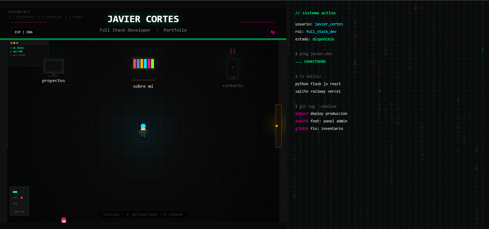

<div align="center">

# Portfolio · Javier Cortés

**Full Stack Developer · Chile**

Un portfolio interactivo con formato de juego RPG. En vez de una página estática, explorás una habitación pixel-art y desbloqueás secciones hasta habilitar el contacto.


<br>



</div>

<br>

## Sobre el proyecto

Portfolio personal pensado como una experiencia, no como un CV plano. Movés a tu personaje por la habitación, interactuás con los objetos (computador, estantería, puerta) y cada uno abre un panel tipo terminal con una sección distinta. Cuando explorás todo, se desbloquea el contacto.

Bilingüe (español / inglés), con música y efectos generados en tiempo real.

## Características

- Habitación explorable estilo RPG renderizada en Canvas
- Sistema de misión: visitá todas las secciones para desbloquear el contacto
- Paneles tipo terminal para cada sección
- Soporte de idioma ES / EN
- Música de fondo generada con Web Audio y control de mute
- Efecto Matrix lateral

## Stack

| Capa | Tecnología |
|------|-----------|
| Framework | Next.js 16 (App Router) |
| UI | React 19 + TypeScript |
| Estilos | Tailwind CSS 4 |
| Motor del juego | Canvas API |
| Íconos | @tabler/icons-react |
| Audio | Web Audio API |

## Desarrollo local

```bash
npm install
npm run dev
```

Abrí mi-portfolio-two-flame.vercel.app en el navegador.

## Estructura
